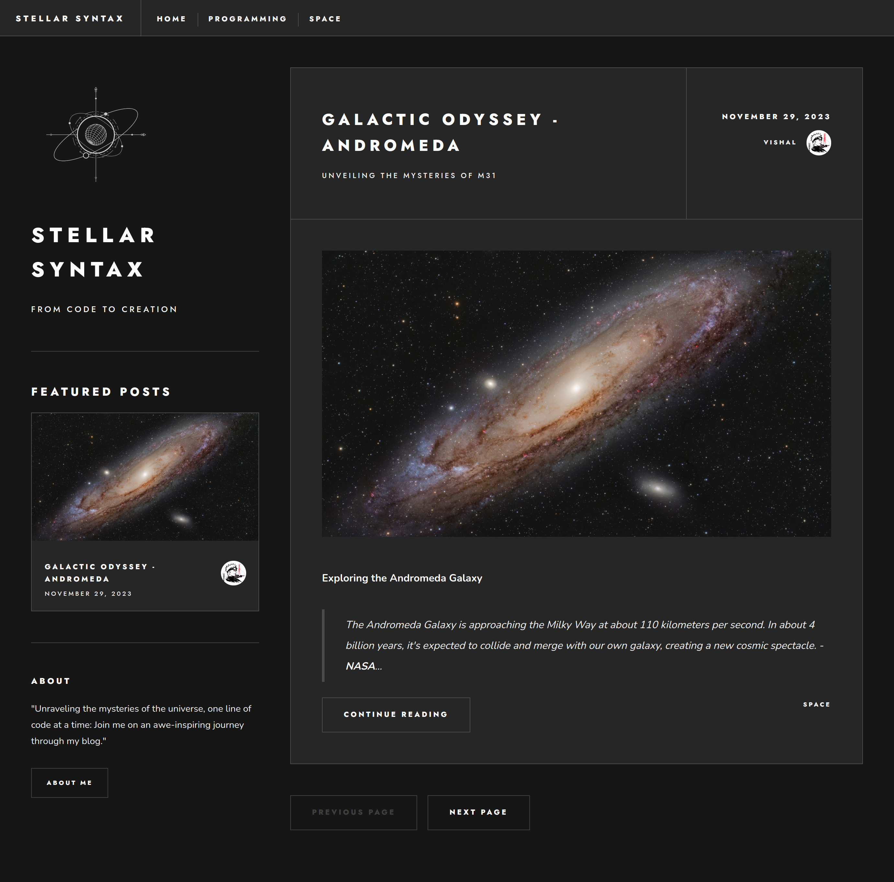
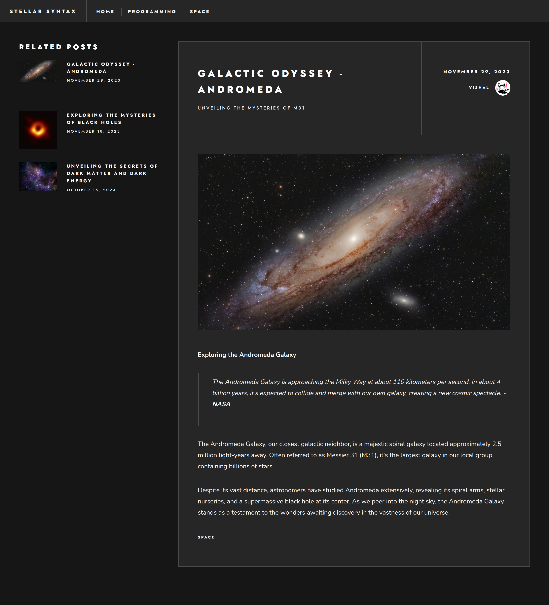

# STELLAR SYNTAX

Stellar Syntax represents my personal blog website, a comprehensive full-stack blog application where I share articles on topics ranging from space exploration to programming.

### Features

- Server-side dynamic routing
- Advanced server-side Filtering
  - Filtering Based on Relations Between Each Blog
  - Filtering by Tags Associated with Blogs
  - Filtering based on featured or not
- Server-side Pagination functionality
- Responsive Design
- Reusable Components
- Markdown content

### Screenshots

### Link to server side application

[stellar syntax server](https://github.com/vishaldethe15/stellar-syntax-server).
